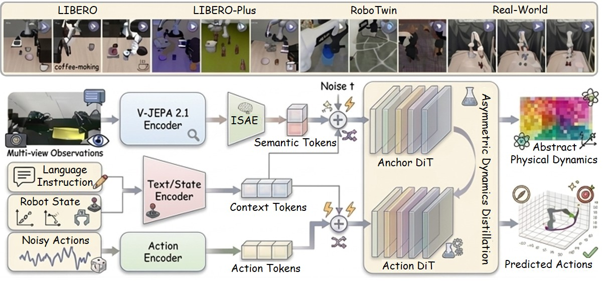
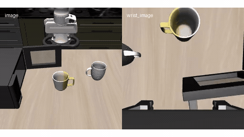
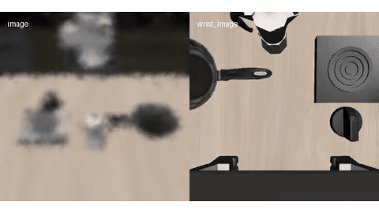
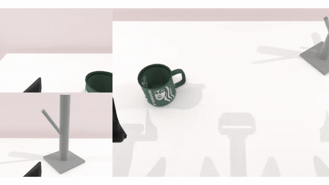
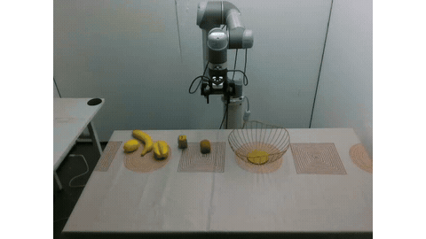

<div align="center">

# LeapBot-WA

### World-Anchor Action Models via Predictive Latent Alignments

**Pei Liu<sup>1,2,*</sup> · Nan Zheng<sup>3,*</sup> · Lang Zhang<sup>3,*,†</sup> · Daojie Peng<sup>1</sup> · Yanan Zhang<sup>3</sup> · Feilong Kong<sup>4</sup>**<br>
**Mingyue Feng<sup>3</sup> · Jiachao Liu<sup>3</sup> · Yaonong Wang<sup>3</sup> · Qifeng Chen<sup>2</sup> · Jun Ma<sup>1,2,‡</sup>**

<sup>1</sup> The Hong Kong University of Science and Technology (Guangzhou)<br>
<sup>2</sup> The Hong Kong University of Science and Technology<br>
<sup>3</sup> Leapmotor &nbsp;&nbsp; <sup>4</sup> Southeast University

<sup>*</sup> Equal contribution. &nbsp; <sup>†</sup> Project leader. &nbsp; <sup>‡</sup> Corresponding author.

[](https://arxiv.org/abs/2607.23969)
[](https://www.alphaxiv.org/abs/2607.23969)

**Learning predictive world dynamics for efficient robotic control.**

</div>

Official repository for [**LeapBot-WA: World-Anchor Action Models via Predictive Latent Alignments**](https://arxiv.org/abs/2607.23969).

> **Inference code coming soon.** This repository currently presents the method and demonstration videos. The upcoming code release will focus on inference and deployment; training code is outside the planned release scope.

[News](#news) · [Overview](#overview) · [Demos](#demos) · [Release Status](#release-status) · [Getting Started](#getting-started) · [Citation](#citation)

## News

- **2026/09/08:** Added the model architecture and demonstrations from LIBERO, LIBERO-Plus, RoboTwin, and real-world manipulation.
- **2026/07/30:** Updated paper available on [arXiv](https://arxiv.org/abs/2607.23969v2).

## Overview

LeapBot-WA learns robotic actions through predictive semantic alignment in a latent space. It uses a Joint-Embedding Predictive Architecture (JEPA) as a **World-Anchor**, providing physical dynamics guidance without pixel-level video generation.

The method combines three components:

- **Predictive World-Anchor:** JEPA features provide semantic representations of the environment and its dynamics.
- **Isotropic Semantic Autoencoder (ISAE):** Maps predictive features into a latent space suited to diffusion modeling.
- **Asymmetric Mixture-of-Transformers (MoT):** An Anchor Diffusion Transformer guides an Action Diffusion Transformer during training. The heavy dynamics branch is pruned at inference for efficient action generation.

The [paper](https://arxiv.org/abs/2607.23969) evaluates LeapBot-WA on LIBERO, RoboTwin 2.0, unseen visual conditions, and real-world robotic manipulation.

<div align="center">
  <a href="main_wam2.jpg">
    
  </a>
  <p><strong>LeapBot-WA architecture.</strong> Visual features and language/state context condition the action model. The Anchor DiT supplies dynamics guidance during training and is omitted at inference. Click the figure to enlarge.</p>
</div>

## Demos

The animations below are lightweight previews (up to 12 seconds). **Click a preview or its video link to open the full MP4.**

<table>
  <tr>
    <td width="50%" align="center" valign="top">
      <h3>LIBERO</h3>
      <a href="leapbot-wa-video2.mp4"></a>
      <p>Simulated manipulation with external and wrist camera views.</p>
      <a href="leapbot-wa-video2.mp4">Watch full video</a>
    </td>
    <td width="50%" align="center" valign="top">
      <h3>LIBERO-Plus</h3>
      <a href="leapbot-wa-video3.mp4"></a>
      <p>Manipulation under visual perturbations.</p>
      <a href="leapbot-wa-video3.mp4">Watch full video</a>
    </td>
  </tr>
  <tr>
    <td width="50%" align="center" valign="top">
      <h3>RoboTwin</h3>
      <a href="assets/videos/robotwin-demo.mp4"></a>
      <p>Multi-view robotic manipulation in simulation.</p>
      <a href="assets/videos/robotwin-demo.mp4">Watch full video</a>
    </td>
    <td width="50%" align="center" valign="top">
      <h3>Real-World Manipulation</h3>
      <a href="leapbot-wa-video1.mp4"></a>
      <p>Tabletop manipulation on a physical robot.</p>
      <a href="leapbot-wa-video1.mp4">Watch full video</a>
    </td>
  </tr>
</table>

## Release Status

- [x] Paper available on [arXiv](https://arxiv.org/abs/2607.23969) and [alphaXiv](https://www.alphaxiv.org/abs/2607.23969).
- [x] Project README.
- [x] Model architecture and demonstration videos.
- [ ] Inference code.
- [ ] Installation and model preparation instructions.
- [ ] Inference examples and deployment documentation.

## Getting Started

The inference package is being prepared for release. Installation instructions, model asset requirements, and runnable examples will be added here when the code is available.

For now, explore the [model overview](#overview), watch the [demos](#demos), and read the [paper](https://arxiv.org/abs/2607.23969) for the full methodology and experimental results. Questions about the paper can also be discussed on [alphaXiv](https://www.alphaxiv.org/abs/2607.23969).

## Citation

If you find this work useful, please cite:

```bibtex
@misc{liu2026leapbotwaworldanchoractionmodels,
  title         = {LeapBot-WA: World-Anchor Action Models via Predictive Latent Alignments},
  author        = {Pei Liu and Nan Zheng and Lang Zhang and Daojie Peng and Yanan Zhang and Feilong Kong and Mingyue Feng and Jiachao Liu and Yaonong Wang and Qifeng Chen and Jun Ma},
  year          = {2026},
  eprint        = {2607.23969},
  archivePrefix = {arXiv},
  primaryClass  = {cs.RO},
  url           = {https://arxiv.org/abs/2607.23969}
}
```
